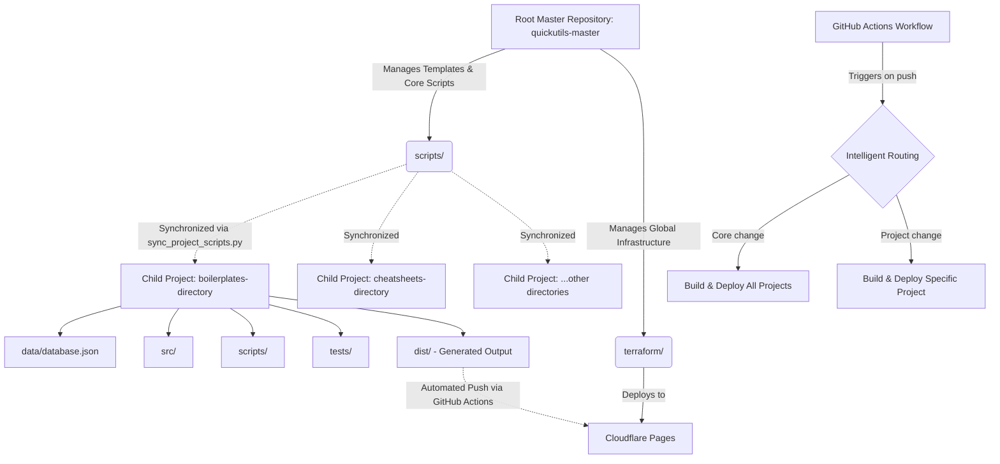

# Architecture Overview

## Architecture Tree

## System Workflow
1. **Data Ingestion**: Specific scripts (e.g., `fetch_data.py`) aggregate or parse initial dataset into localized `data/database.json`.
2. **Static Site Generation**: `build_directory.py` reads `database.json`, ingests Jinja templates from `src/templates`, and renders static files (HTML, JSON, XML) into the `dist/` directory.
3. **Synchronization**: `sync_project_scripts.py` ensures all child projects have the latest master scripts and shared templates before testing or generating content.
4. **Testing**: `pytest` traverses `tests/` directories to confirm generation boundaries, link integrity, and snippet logic.
5. **Deployment**: GitHub Actions catches pushes, determines the changed boundaries, and invokes Cloudflare deployments automatically based on Terraform pre-provisioned projects.
